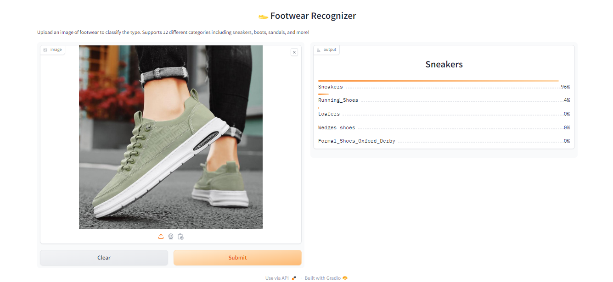

# Footwear Recognizer Model

  

  
  

---

## Project Overview
The **Footwear Recognizer** is a deep learning model built with **FastAI** that can classify footwear into **12 categories**.  
It uses a ResNet-based CNN architecture, trained on a curated dataset of footwear images.  

### Key Features
- **Upload any footwear image** and get instant predictions  
- Recognizes **12 distinct footwear categories**: Sneakers, Sandals, Boots, Heels, Loafers, Flip-Flops, etc.  
- **Deployed live** using **Hugging Face Spaces (Gradio App)**  
- Cleaned & preprocessed dataset (~500 images per category initially, reduced after cleaning)  
- Built with **FastAI + ResNet34 + Transfer Learning**  

---

## Data Collection & Cleaning
- Data was collected from **web sources** (browser-based image scraping).  
- Raw dataset contained significant **noise** (irrelevant objects, multi-class images, duplicates).  
- Used **FastAI’s ImageClassifierCleaner** extensively to:  
  - Identify and remove mislabeled or noisy images  
  - Delete irrelevant or low-quality images  
  - Refine the dataset iteratively after each training cycle  
- Final dataset was much cleaner and better structured, ensuring **higher model reliability**.  
- Data cleaning was the **most time-consuming part** of this project, but it greatly improved model performance.  

---

## Model Training
- Architecture: **ResNet34 (transfer learning)**  
- Training Strategy:  
  - Fine-tuned in **multiple iterations** (4 cycles total)  
  - Each cycle: **5 epochs** of training  
  - After every cycle → dataset re-cleaning with ImageClassifierCleaner  
  - Final cycle: training without additional cleaning (final iteration)  
- Achieved up to **~86% accuracy** on validation data.  

---

## 🧠 How It Works
1. Upload an image of footwear (JPG/PNG).  
2. The image is processed using a **ResNet34 CNN** trained with FastAI.  
3. The model outputs the **top 5 predictions with probabilities**.  

👉 **[Try the model live here](https://huggingface.co/spaces/Arefen017/Footwear-Recognizer-model)**  

---

